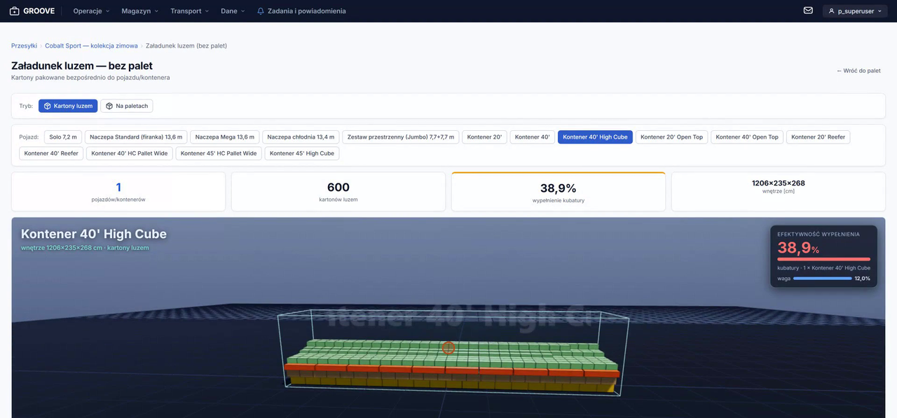

# GROOVE / PalViz

[](https://github.com/TomaszWu14/palviz-portfolio/actions/workflows/ci.yml)



**Platforma magazynowa dla zespołów magazynu, transportu i obsługi klienta: planuje palety i załadunek w 3D, wycenia przesyłki, pokazuje mapę magazynu i prowadzi kontrolę HU na skanerach.**

> **Projekt portfolio.** Nazwy firm są zamienione na fikcyjne, a dane demo i testowe są syntetyczne.

Aplikacja magazynowo-paletyzacyjna dla **ACME**. Platforma
GROOVE (modularny monolit Django) obejmuje master data, paletyzację, wycenę przesyłek,
mapę 3D magazynu z heatmapą, kontrolę HU (skaner), zadania/powiadomienia i bazę klientów.
Rdzeń pakowania to samodzielny, bezframeworkowy pakiet `palletizer/` (używany też przez
web). Szczegóły architektury: [`ARCHITECTURE.md`](ARCHITECTURE.md); wskazówki dla
asystentów AI i pełny opis modułów: [`CLAUDE.md`](CLAUDE.md).

> Kod udostępniony do wglądu (portfolio), wszelkie prawa zastrzeżone — patrz [`LICENSE`](LICENSE).

## W skrócie

| | |
|---|---|
| **Problem** | Planowanie palet i wysyłek, kontrola HU i obraz magazynu rozproszone w Excelu i SAP — brak wspólnego narzędzia dla magazynu, transportu i obsługi klienta. |
| **Rozwiązanie** | Modularny monolit: master data i optymalizacja kartonów, paletyzacja (heurystyki + OR-Tools/py3dbp), wycena przesyłek, kontrola HU na skanerach (PWA), mapa 3D magazynu z heatmapą ruchu, zadania i powiadomienia, asystent AI. |
| **Stack** | Python 3.11, Django 5.2 LTS, PostgreSQL 16, Celery, django-ninja (API), three.js / ECharts, Playwright, Docker, Coolify. |
| **Jakość** | Testy jednostkowe paletyzatora + testy Django z pokryciem (próg 80%), CI na GitHub Actions z PostgreSQL, CodeQL i skany bezpieczeństwa. |
| **Dane** | Wszystkie dane są fikcyjne — m.in. układ hali B0 pochodzi z generatora `web/ui/data/generate_synthetic_b0.py`. |

## Mój wkład

- **Projekt i implementacja całości** — jestem jedynym autorem: od analizy procesów magazynowych, przez model danych i architekturę, po UI, testy, CI/CD i wdrożenie.
- **Rdzeń pakowania** `palletizer/` — heurystyki warstw (MaxRects, wzory cegiełkowe, pasy mieszane) + OR-Tools/py3dbp, bez zależności od Django.
- **Skala:** ok. 2700 testów (biblioteka pakowania + Django na PostgreSQL w CI), ok. 420 tras URL w modułach `ui`, `wh3d`, `huctl`, `transport`, `core`.
- **Proces i jakość:** 18 zapisanych decyzji architektonicznych ([`docs/adr/`](docs/adr/)), rejestr błędów wykrytych przez testy regresji ([`BUGS-FOUND.md`](BUGS-FOUND.md)), auto-merge przez PR i deploy na Coolify.

## Dlaczego ten stack

Django jako modularny monolit z hubem modułów daje jeden deploy, wspólne uprawnienia i panel admina dla wielu małych modułów ([ADR-0001](docs/adr/0001-modularny-monolit-hub-modulow.md)). Algorytmy pakowania żyją w czystym Pythonie bez frameworka, więc testuje się je szybko i używa też z CLI ([ADR-0002](docs/adr/0002-palletizer-bez-django.md)). SAP jest tylko źródłem do odczytu, żeby aplikacja nie mogła zepsuć systemu księgowego ([ADR-0003](docs/adr/0003-sap-tylko-do-odczytu.md)). Synchroniczny WSGI z Celery do zadań w tle jest prostszy w utrzymaniu niż async ([ADR-0004](docs/adr/0004-synchroniczny-wsgi-celery.md)), a biblioteki front-endu są vendorowane bez CDN ([ADR-0005](docs/adr/0005-vendorowane-biblioteki-bez-cdn.md)). Nazwy grup ról to zamrożony kontrakt z SSO ([ADR-0006](docs/adr/0006-nazwy-grup-rol-zamrozony-kontrakt.md)); SQLite lokalnie, PostgreSQL w CI i na produkcji ([ADR-0007](docs/adr/0007-sqlite-domyslnie-postgres-przygotowany.md)).

## Ograniczenia i co dalej

- **SAP tylko do odczytu, bez czasu rzeczywistego** — integracja SAP real-time jest zawieszona ([`ROADMAP_HU_ZARIA.md`](ROADMAP_HU_ZARIA.md)).
- **Asystent ZARIA** — streaming, załączniki i RAG czekają na klucz API / serwer Ollama; dostawcy zgodni z OpenAI wymagają doinstalowania pakietu `openai` (B-010 w [`BUGS-FOUND.md`](BUGS-FOUND.md)).
- **CSP w trybie report-only** — polityka jest raportowana, a nie wymuszana ([ADR-0008](docs/adr/0008-csp-report-only.md)).
- **Zatwierdzanie błędów kontroli HU przez lidera** odroczone — workflow do zaprojektowania.
- **Monolit** — rozbicie na usługi jest tylko rozważane ([`ARCHITECTURE-MICROSERVICES.md`](ARCHITECTURE-MICROSERVICES.md)); dziś wszystko wdraża się razem.

## Gdzie zacząć czytać kod

- [`palletizer/services/pallet_calculator.py`](palletizer/services/pallet_calculator.py) — generowanie i wybór wariantów ułożenia kartonów na palecie.
- [`web/huctl/queue_rank.py`](web/huctl/queue_rank.py) — kolejkowanie kontroli HU na skanerach.
- [`web/palletweb/config.py`](web/palletweb/config.py) — typowana konfiguracja z walidacją przy starcie (fail-fast).

Historia commitów została zgnieciona przy przygotowaniu wersji portfolio (anonimizacja).

## Wideo

Wkrótce (YouTube).

## Układ repo

```
main.py         CLI samodzielnego paletyzatora
palletizer/     bezframeworkowa biblioteka pakowania (geometria, domena, IO, wizualizacja)
web/            projekt Django `palletweb` + jedna aplikacja `ui`
```

## Aplikacja webowa (lokalnie)

```bash
python -m venv .venv && source .venv/bin/activate   # Windows: setup.bat
pip install -r requirements.txt
cd web
DJANGO_DEBUG=true python manage.py migrate
DJANGO_DEBUG=true python manage.py createsuperuser
DJANGO_DEBUG=true python manage.py create_roles      # grupy ról (Polish)
DJANGO_DEBUG=true python manage.py runserver 8080   # lub: run.bat
```

Aplikacja: `http://localhost:8080` · admin: `/admin` · logowanie: `/login/`.
W trybie `DJANGO_DEBUG=true` Celery działa **eager** (bez workera/Redis); front-endowe
biblioteki 3D są vendorowane — jeśli `web/ui/static/ui/vendor/` jest puste, uruchom raz
`sh web/scripts/fetch_vendor.sh`.

## Docker (produkcyjnie)

```bash
docker compose up --build       # gunicorn :8000 + Redis
```

`docker-entrypoint.sh` migruje, ustawia właściciela wolumenów i startuje gunicorna jako
**użytkownik nieuprzywilejowany** (gosu). Obraz jest multi-stage (chudy runtime).

## Konfiguracja (zmienne środowiskowe)

Typowana i **walidowana przy starcie** przez pydantic-settings
([`web/palletweb/config.py`](web/palletweb/config.py)) — brak/niepoprawna zmienna
przerywa boot z czytelnym komunikatem. Szablon: [`.env.example`](.env.example). Najważniejsze:

| Zmienna | Opis |
|---|---|
| `DJANGO_SECRET_KEY` | wymagana gdy `DJANGO_DEBUG=false` (boot odrzuca klucz dev) |
| `DJANGO_DEBUG`, `DJANGO_ALLOWED_HOSTS`, `DJANGO_CSRF_TRUSTED_ORIGINS` | podstawy Django |
| `DATABASE_URL` | Postgres (`postgresql://…?sslmode=require`); brak → SQLite |
| `CELERY_BROKER_URL` | Redis (zadania w tle + beat) |
| `SENTRY_DSN`, `OTEL_ENABLED` | opcjonalny monitoring/tracing |
| `EMAIL_*`, `WAREHOUSE_EMAIL` | SMTP (wyceny/gotowość) |
| `POWERBI_*` | pobieranie stocku z Power BI / SAP BW |
| `PALVIZ_API_TOKEN`, `PALVIZ_API_TOKENS` | `X-API-Key` dla API `/api/v2` (skaner HU, n8n); nazwani klienci z zakresami — [`docs/n8n-integration.md`](docs/n8n-integration.md#klienci-api-i-zakresy-apiv2-audyt-sec-017) |

Pełna lista i domyślne wartości: `config.py` + `CLAUDE.md`.

## Testy

```bash
# Zależności testów (hypothesis, tblib, factory_boy, time-machine, PyYAML…)
pip install -r requirements-test.txt

# Biblioteka pakowania (bezframeworkowa)
python -m unittest discover -s palletizer/tests -p "test_*.py"

# Django (z web/, z env)
cd web
DJANGO_SECRET_KEY=ci-test-secret DJANGO_DEBUG=true DJANGO_ALLOWED_HOSTS='*' \
  PYTHONPATH=.. python manage.py test ui.tests wh3d.tests huctl.tests transport.tests -v 1
```

CI ([`.github/workflows/ci.yml`](.github/workflows/ci.yml))
bramkuje merge na obu pakietach; ruff/mypy/pip-audit/bandit lecą jako non-blocking.
Gałęzie `claude/**` auto-mergują do `main` po zielonych testach i wyzwalają deploy Coolify.

## Git hooks

`pre-commit install` — lintery, formatowanie i skan sekretów z
[`.pre-commit-config.yaml`](.pre-commit-config.yaml) przed każdym commitem.

## Samodzielny paletyzator (CLI)

```bash
python main.py --mode csv --input data/produkty.csv --pallet EU --max-height 180 --export-viz 1
```

Wynik w `output/` (`wynik.csv`, `warianty.csv`, wizualizacje PNG/HTML). Flagi:
`--mode {csv|cli}`, `--input`, `--pallet {EU|Z129}`, `--max-height`, `--length`, `--width`,
`--export-viz {0|1}`, `--render-layers N`. Wejście CSV: kolumny
`SKU,WARIANT,L,W,H,WAGA_SZT,SZT_W_KARTONIE,ILOSC_SZT` (+ opcjonalnie `KARTON_TARE`);
wymiary w cm, wagi w kg, ilości w sztukach.
