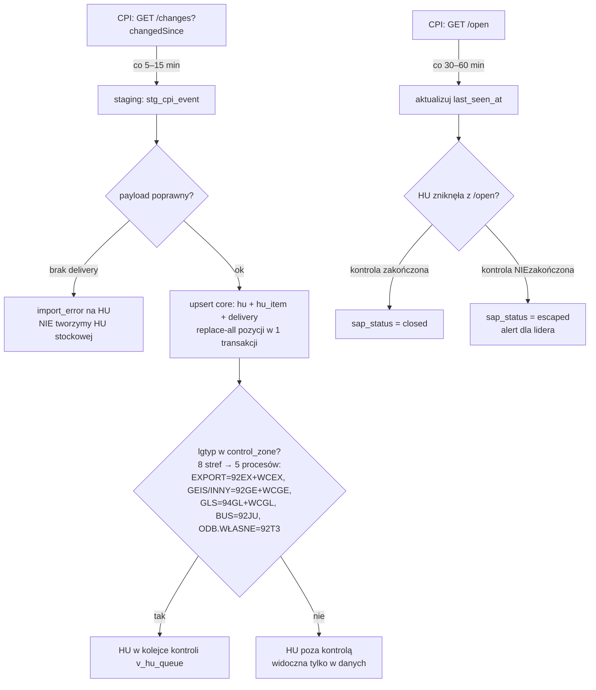
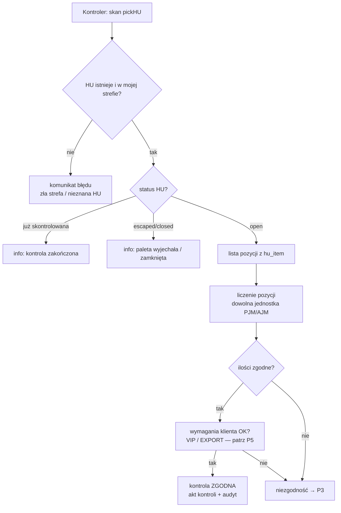
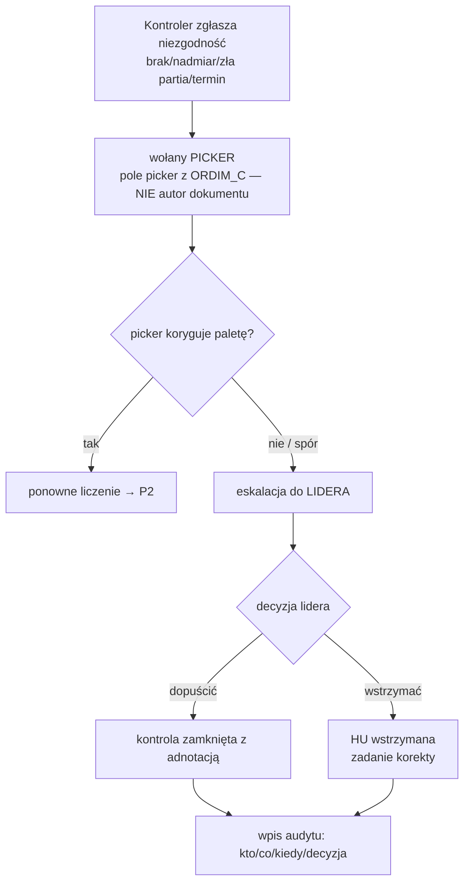
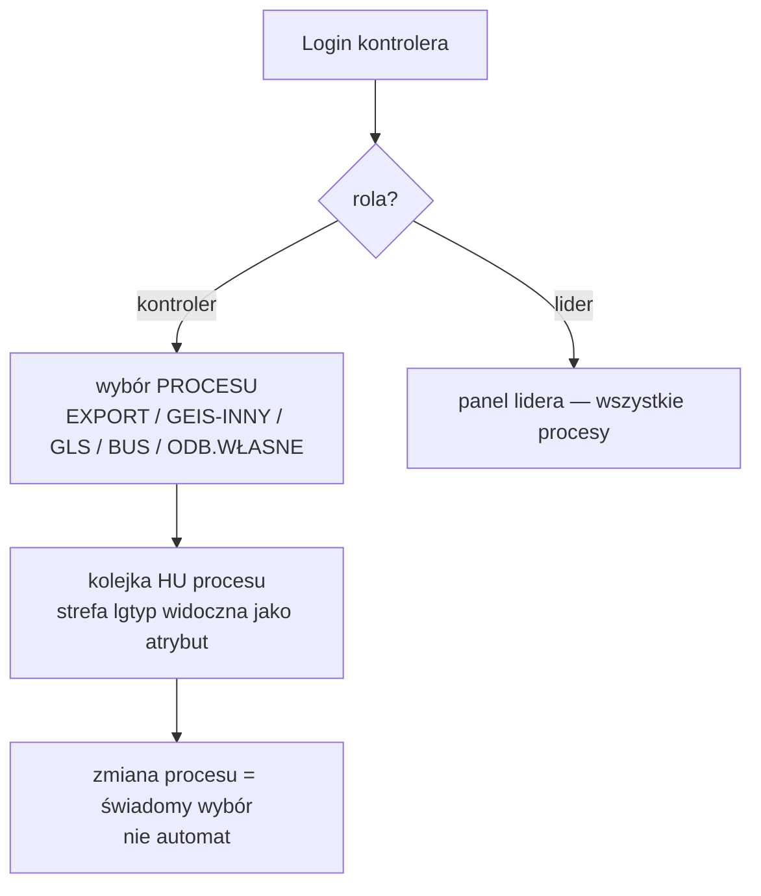
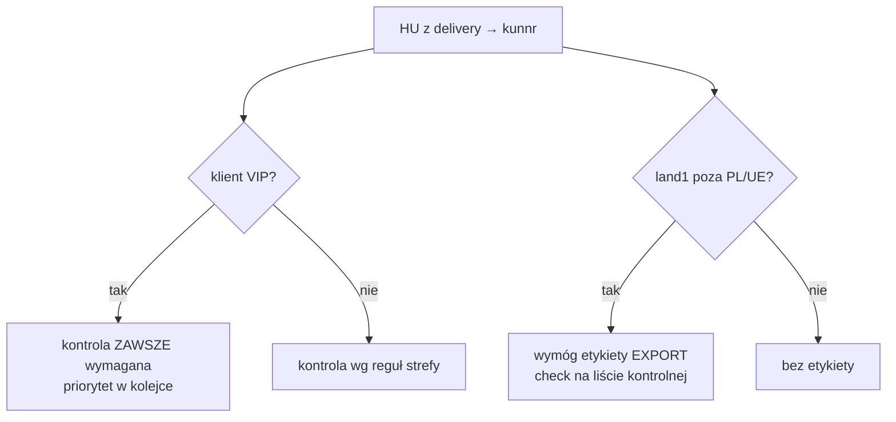
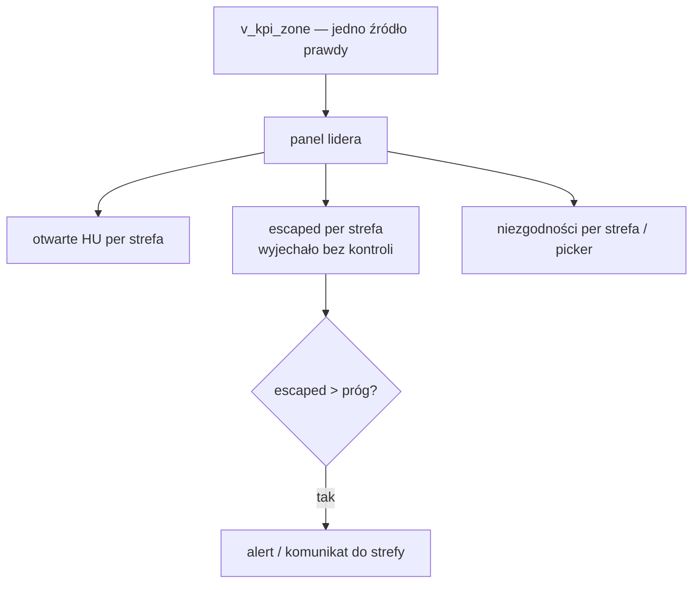

# HU-CHECK — mapy procesów (Kontrola HU)

Źródło prawdy dla przebiegów. Mermaid renderuje się na GitHubie; wersje PNG/PDF dla
Konsultant generować z tych bloków (`/diagram`). Kontrakt danych: `hu-control-cpi-spec.md`,
architektura: `hu-check-architektura-danych.md`.

---

## P1. Napływ HU z SAP (delta + reconcile)



## P2. Kontrola palety



## P3. Obieg niezgodności



## P4. Login i wybór strefy



## P4a. Konsolidacja międzyprocesowa (rodzina odbiorcy)

```mermaid
flowchart TD
    A[Rodzina = wszystkie HU odbiorcy\nrozwinięcie: lokalizacja per HU] --> B{HU w moim procesie?}
    B -->|tak| C[Przypisz do mnie → kontrola P2]
    B -->|nie, np. GLS gdy jestem w GEIS| D[przypisanie ZABLOKOWANE\nHU widoczna, przycisk nieaktywny]
    D --> H{fracht dostawy tej HU\n= fracht mojej grupy?}
    H -->|brak frachtu / inny| I[PILNY mail do działu TRANSPORTU:\n„przepnij dostawę X - HU Y - na fracht Z"]
    I --> J[transport przepina dostawę na fracht]
    J --> E
    H -->|zgodny| E[wiadomość: prośba o przyniesienie\nHU/paczki na moją strefę]
    E --> F[HU dostarczona na strefę]
    F --> C
    C --> G[kontrola + wysyłka RAZEM po konsolidacji]
```

Fracht przy HU: numer frachtu dostawy widoczny w rodzinie (źródło SAP — pytanie #4
w kontrakcie; **kolejność/pilność frachtów prawdopodobnie z SharePointa** działu
transportu — tam frachty są dzielone na pilne/zwykłe; do potwierdzenia jako osobne
źródło danych poza SAP). Szablon maila do działu transportu (ustalony 2026-09-03):

Trzy warianty (dobierane automatycznie wg stanu frachtów w rodzinie):

> 1. **Przepięcie:** „Proszę o przepięcie dostawy XXXXXX z frachtu XXXX na fracht XXXXXX"
> 2. **Nadanie** (dostawa bez frachtu): „Proszę o nadanie frachtu dla dostawy XXXXXX"
> 3. **Dopisanie do frachtu rodziny:** „Proszę o dopisanie dostawy XXXXXX (HU XXXXXX)
>    do frachtu XXXXXX pozostałych dostaw tego odbiorcy"

— pola: nr dostawy (z HU), fracht obecny, fracht docelowy = fracht pozostałych HU
rodziny/konsolidacji. Docelowo przycisk „Zgłoś przepięcie" przy HU spoza strefy
wypełnia właściwy wariant automatycznie i wysyła mailem (EMAIL_* w env),
z fallbackiem mailto: jak w wycenie przesyłek.

## P5. Wymagania klienta (VIP / EXPORT)



## P6. KPI i panel lidera


