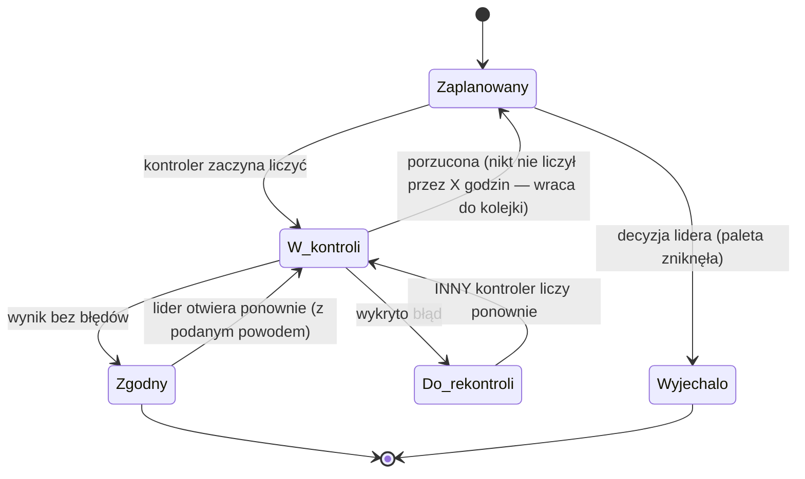
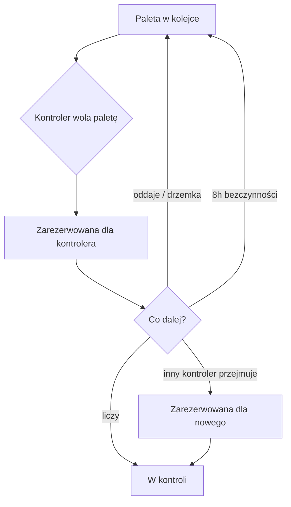
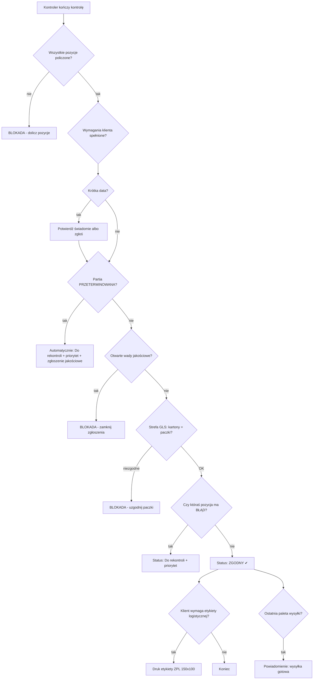

# Kontrola HU — mapa procesu (stan faktyczny)

Dokument dla pracowników magazynu. Opisuje, **jak dziś działa moduł Kontrola HU w GROOVE** —
krok po kroku, z bramkami i scenariuszami. Bez żargonu technicznego; nazwy techniczne są tylko
w przypisach na końcu, dla zespołu IT.

Stan na: 2026-08-26 (spisane z działającej aplikacji, nie z pamięci).

---

## 1. Statusy palety (HU) — cykl życia

Każda paleta w kontroli ma zawsze dokładnie jeden status:

| Status | Co znaczy | Kto może zmienić |
|---|---|---|
| **Zaplanowany** | Paleta czeka w kolejce na kontrolę | — |
| **W kontroli** | Ktoś ją właśnie liczy (paleta zablokowana) | kontroler |
| **Zgodny** | Kontrola zakończona, wszystko się zgadza | tylko lider może cofnąć |
| **Do rekontroli** | Wykryto błąd — musi policzyć **inna osoba** | kontroler (przy błędzie) |
| **Wyjechało bez kontroli** | Paleta zniknęła z magazynu przed kontrolą | tylko lider |



Zasady twarde:
- Status „Zgodny" wymaga zapisanej daty i godziny weryfikacji — nie da się go nadać „na skróty".
- Rekontrolę robi **zawsze inna osoba** niż ta, która liczyła pierwotnie (lider/admin może wyjątkowo).
- Palety „W kontroli" i „Do rekontroli" są zablokowane dla wysyłki.

---

## 2. Które palety w ogóle podlegają kontroli? (bramka wejściowa)

1. Kontrolowane są tylko palety ze **stref (typów magazynowych) oznaczonych jako kontrolowane**
   — listę stref ustawia lider na ekranie „Typy kontrolowane".
2. **Wyjątek VIP:** paleta klienta VIP podlega kontroli **zawsze**, niezależnie od strefy.
3. Kontroler widzi tylko palety ze **swoich stref** (przypisanie kontroler↔strefa robi lider;
   lider i admin widzą wszystko).

---

## 3. Kolejka — kto liczy co i w jakiej kolejności

Kolejka ustawia palety automatycznie. Kolejność (od najważniejszej):

1. **Priorytet** (paleta oznaczona jako pilna)
2. **Do rekontroli** przed „Zaplanowany"
3. **Klient VIP**
4. Ranga klienta
5. **Krótka data** (ważność ≤ ~pół roku)
6. Starsze wysyłki przed nowszymi
7. Mniejsze/prostsze palety przed większymi

### Rezerwacja palety („wołanie")

- Kontroler **woła** paletę (pojedynczo, całą wysyłkę albo zaznaczone) — paleta jest wtedy
  zarezerwowana dla niego i znika innym z kolejki.
- Można też zawołać **całą grupę odbiorcy** w swojej strefie (wszystkie palety tego samego klienta).
- Rezerwację można **oddać** (z powodem) albo **odłożyć na X minut** (drzemka).
- Inny kontroler może **przejąć rezerwację** — poprzedni dostaje powiadomienie.
- **Rezerwacja wygasa automatycznie** po 8 godzinach bezczynności — paleta wraca do kolejki.
- Przycisk **„Następna"**: jeśli masz paletę w trakcie liczenia — wraca do niej; jeśli nie —
  daje najpierw twoje zarezerwowane, potem pierwszą z kolejki.



---

## 4. Liczenie palety — krok po kroku z bramkami

```mermaid
flowchart TD
    S[Skan etykiety HU skanerem] --> G1{BRAMKA 1: skan czy klawiatura?}
    G1 -- wpisane ręcznie, a wymuszony skan --> STOP1[ODMOWA - zeskanuj etykietę]
    G1 -- skan OK --> G2{BRAMKA 2: zdjęcie palety}
    G2 -- urządzenie z aparatem, brak zdjęcia --> FOTO[Zrób zdjęcie palety] --> L
    G2 -- Zebra / zdjęcie jest --> L[Liczenie pozycji]
    L --> L2["Wpisz ilości: sztuki / opakowania / kartony / palety<br/>(system sam przelicza na sztuki)"]
    L2 --> G3{BRAMKA 3: ilość zgodna z wsadem SAP?}
    G3 -- tak --> P[Potwierdź partię i datę ważności] --> NEXT[Następna pozycja]
    G3 -- nie --> G4{BRAMKA 4: „Jestem pewien"?}
    G4 -- nie, przeliczam --> L2
    G4 -- tak --> ERR[Pozycja zapisana jako BŁĄD] --> NEXT
    NEXT --> FIN{Wszystkie pozycje policzone?}
    FIN -- nie --> L
    FIN -- tak --> Z[Zakończenie kontroli - rozdział 5]
```

Bramki przy liczeniu:

| # | Bramka | Zasada |
|---|---|---|
| 1 | **Tylko skaner** (gdy włączone wymuszenie) | ręczne wpisanie numeru HU jest odrzucane |
| 2 | **Zdjęcie palety** (gdy włączone) | urządzenie z aparatem musi najpierw zrobić zdjęcie; Zebra bez aparatu przechodzi |
| 3 | **Ślepe liczenie** | kontroler nie widzi oczekiwanej ilości; przy niezgodności musi potwierdzić „jestem pewien" zanim system zapisze błąd |
| 4 | **Partia + data ważności** | każda pozycja wymaga potwierdzenia partii i daty; brak potwierdzenia = błąd |
| 5 | **Tylko pełne jednostki** | nie da się wpisać połówek |
| 6 | **Liczenie obowiązkowe** | pozycji nietkniętej nie da się „przepuścić" — blokuje zakończenie |

Poza ilością kontroler może zgłosić **wadę jakościową** (uszkodzenie, zła etykieta itp.) —
to osobna ścieżka: wada nie wymusza ponownego liczenia, ale musi zostać zamknięta z opisem
rozwiązania zanim paleta przejdzie kontrolę.

---

## 5. Zakończenie kontroli — bramki końcowe (w tej kolejności)



Co się dzieje automatycznie, gdy paleta idzie **Do rekontroli**:

- powiadomienie do lidera,
- **zadania naprawcze** dla magazynu per pozycja (brak / nadwyżka / uszkodzenie) — trafiają
  do Administratorów i Master Data,
- po kilku nieudanych cyklach rekontroli — **eskalacja** (zadanie + powiadomienie lidera i admina).

Ważne: zakończenie kontroli **niczego nie księguje w SAP** — to wyłącznie zapis wyniku
w GROOVE (SAP jest tylko do odczytu).

---

## 6. Panel lidera — co widzi i co może

**Widzi na żywo:** kto co liczy, wyniki zmiany per kontroler (KPI), sygnały nadużyć
(liczenie „w 3 sekundy", wpisywanie z klawiatury zamiast skanu), zaległe rekontrole z wiekiem,
liczbę palet bez przypisania, niepotwierdzone pilne komunikaty, otwarte wyjątki Master Data.

**Może:**

| Akcja | Opis |
|---|---|
| Przypisz paletę / całą grupę odbiorcy | ręczne przydzielenie kontrolerowi |
| Przejmij kontrolę | zabiera paletę w trakcie |
| Otwórz ponownie „Zgodny" | tylko z powodem; zablokowane gdy paleta już wyjechała |
| „Wyjechało bez kontroli" | zamknięcie palety, której fizycznie nie ma |
| Komunikat pilny | wiadomość do kontrolera z obowiązkowym potwierdzeniem odczytu |
| Zlecenie zdjęcia | zadanie foto dla kontrolera |
| Typy kontrolowane | włącza/wyłącza strefy podlegające kontroli |
| Przypisanie stref | który kontroler widzi którą strefę |
| Eskalacja niekompletnej wysyłki | powiadomienie lidera pickingu / kierownika zmiany |

Dodatkowo **ściana TV**: podgląd stanu kolejki i kontroli per strefa (kolory stref), KPI per strefa.

---

## 7. Scenariusze — ściąga

| # | Scenariusz | Co się dzieje |
|---|---|---|
| 1 | **Wszystko się zgadza** | skan → liczenie → partia+data OK → Zgodny → (etykieta logistyczna jeśli klient wymaga) |
| 2 | **Ilość się nie zgadza** | „jestem pewien" → pozycja BŁĄD → Do rekontroli (priorytet) → liczy inna osoba → zadania naprawcze dla magazynu |
| 3 | **Wada jakościowa** (uszkodzenie itp.) | zgłoszenie wady → paleta nie przejdzie, dopóki wada nie zostanie zamknięta z opisem |
| 4 | **Partia przeterminowana** | automatyczna rekontrola + zgłoszenie jakościowe + priorytet |
| 5 | **Krótka data** (≤ ~6 mies.) | paleta wyżej w kolejce; przy zakończeniu świadome potwierdzenie albo zgłoszenie |
| 6 | **Klient VIP** | zawsze kontrola (nawet strefa niekontrolowana), wyżej w kolejce |
| 7 | **Strefa GLS** | dodatkowa bramka: liczba kartonów musi zgadzać się z paczkami |
| 8 | **Paleta porzucona** (zawołana, nikt nie liczy) | po 8 h rezerwacja wygasa; rozpoczęta a nieliczona wraca do „Zaplanowany" |
| 9 | **Paleta zniknęła z magazynu** | lider: „Wyjechało bez kontroli" (+ automatyczne zadanie wyjaśniające) |
| 10 | **Pomyłka po zatwierdzeniu** | lider otwiera ponownie z powodem — o ile paleta jeszcze nie wyjechała |

---

## Przypis techniczny (dla IT)

Statusy i przejścia: `web/huctl/models_hu.py:17-23`, `hu_helpers.py:300-309` (log zdarzeń).
Kolejka i sortowanie: `hu_helpers.py:100-139`; gating stref/VIP: `hu_helpers.py:30-43,147-154`.
Rezerwacje: `hu_helpers.py:318-329`, wygasanie `:58-72` (`HU_RESERVED_MAX_HOURS`), auto-zwrot
`:75-97` (`HU_INCONTROL_RELEASE_HOURS`). Bramki skanu: `hu_hub.py:205-240` (`HU_SCAN_ENFORCE`),
foto `:243-252` (`HU_PHOTO_ENFORCE`). Liczenie i ślepa bramka: `hu_count.py:212-277,358-391`.
Finalizacja (kolejność bramek): `hu_transaction_final.py:63-193`; rekontrola inną osobą:
`hu_helpers.py:165-171`. Panel lidera: `hu_leader.py:11-120`. Etykieta logistyczna:
`hu_transaction_card.py:180-204`. Role: `ui/roles.py:80-87,130-131`. Wydruk HU (projekty
Polska/Export/VIP…) to osobny moduł `hu_print.py` — poza przepływem kontroli.
